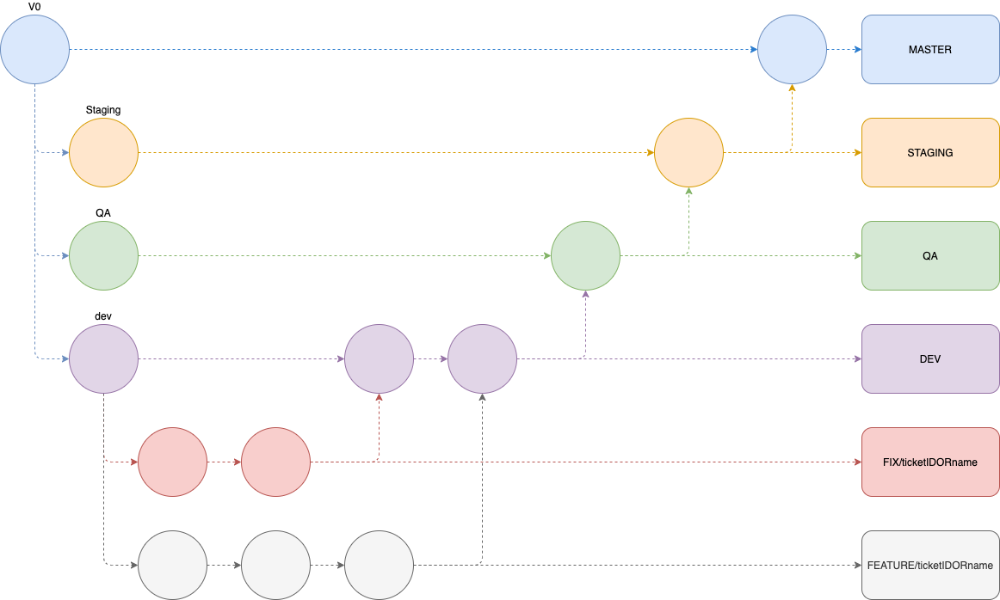

## Run the project

To start the back-end part of the project, run the following command

```bash
$ npm i 
$ docker-compose up
```

## Fixtures

### Create Fixture
```bash
$ docker-compose exec api npm run fixture:create "fileName"
```

### Run Fixtures
```bash
$ docker-compose exec api npm run fixtures
```

## Migrations

### Create Migration
```bash
$ docker-compose exec api npm run migration:create "fileName"
```
Once the file is created copy the skeleton from "migrations/migration.example.js" and paste it in the created file

### Run Migrations
```bash
$ docker-compose exec api npm run db:migrate
```

### Undo Migration
```bash
$ docker-compose exec api npm run db:migrate:undo
```

## Git workflow

Each commit must contain "commit labels", so we can easily identify the purpose of each commit. The commit must contain the smallest amount of modification to allow easy rollback if needed.

### Commit labels

**[feat] #FEATURE_NAME (If needed) Commit message ...**           => Used for new features

**[fix] #ISSUE_NAME (If needed) Commit message ...**              => Used for fixes

**[update] Commit message ...**                                   => Used for update documentation, such as Readme.md, default conf example

**[upstream] Update/Add dependencies [DEPENDENCY_NAME] (If needed)**  => Used for update/add npm dependencies

### Git-flow


