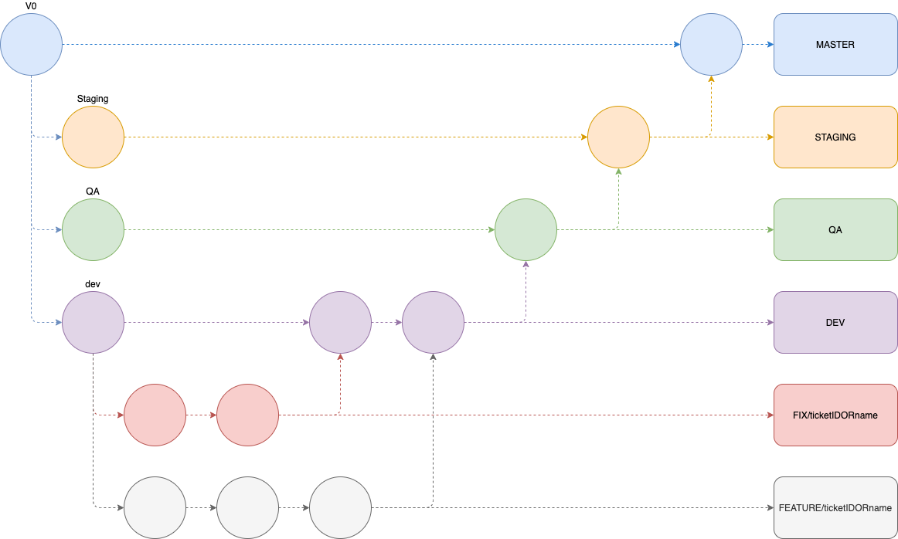

## Run the project

To start the back-end part of the project, run the following command

```bash
$ npm i 
$ docker-compose up
```

## Fixtures

### Create Fixture
```bash
$ docker-compose exec api npm run fixture:create "fileName"
```

### Run Fixtures
```bash
$ docker-compose exec api npm run fixtures
```

## Migrations

### Create Migration
```bash
$ docker-compose exec api npm run migration:create "fileName"
```
Once the file is created copy the skeleton from "migrations/migration.example.js" and paste it in the created file

### Run Migrations
```bash
$ docker-compose exec api npm run db:migrate
```

### Undo Migration
```bash
$ docker-compose exec api npm run db:migrate:undo
```

## Git workflow

Each commit must contain "commit labels", so we can easily identify the purpose of each commit. The commit must contain the smallest amount of modification to allow easy rollback if needed.

### Commit labels

**[feat] #FEATURE_NAME (If needed) Commit message ...**           => Used for new features

**[fix] #ISSUE_NAME (If needed) Commit message ...**              => Used for fixes

**[update] Commit message ...**                                   => Used for update documentation, such as Readme.md, default conf example

**[upstream] Update/Add dependencies [DEPENDENCY_NAME] (If needed)**  => Used for update/add npm dependencies

### Git-flow




## Kubernetes

### Créer le cluster en local

* `minikube start --vm-driver=hyperkit`
* `kubectl create secret generic pgpassword --from-literal PGPASSWORD=rKQbt86bt3zt44aB`
* `minikube addons enable ingress`
* `kubectl apply -f k8s`


### Lancer les fixtures

* `kubectl get pods`
* `kubectl exec -it (nom du pod du server) -- sh`


### AWS S3

* Aller dans le service S3 amazon
* Créer un bucket
* Créer un dossier uploads
* Rendre ce dossier publique
* Changer le nom du bucket dans docker-compose et dans client-deployment
* Aller dans le service IAM, créer des clés d'accès
* Changer les clés dans le docker-compose et dans le client-deployment

### INGRESS SETUP ON GCP
* `curl -fsSL -o get_helm.sh https://raw.githubusercontent.com/helm/helm/master/scripts/get-helm-3
chmod 700 get_helm.sh
./get_helm.sh`
* `helm repo add ingress-nginx https://kubernetes.github.io/ingress-nginx`
* `helm install my-release ingress-nginx/ingress-nginx`

### HTTPS SETUP ON GCP

* `kubectl create namespace cert-manager`
* `helm repo add jetstack https://charts.jetstack.io`
* `helm repo update`
* `helm install \
  cert-manager jetstack/cert-manager \
  --namespace cert-manager \
  --version v1.2.0 \
  --create-namespace
  `
    
* `kubectl apply -f https://github.com/jetstack/cert-manager/releases/download/v1.2.0/cert-manager.crds.yaml`
  https://cert-manager.io/docs/installation/kubernetes/#installing-with-helm